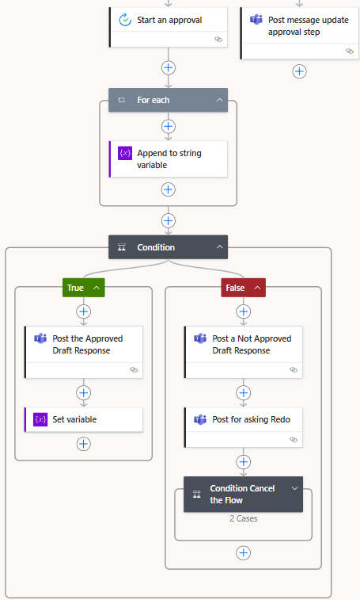
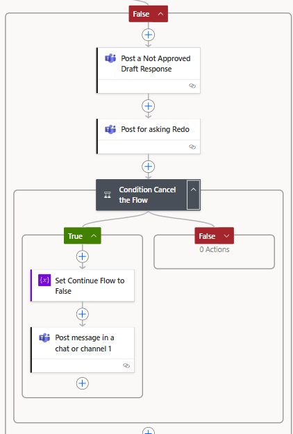
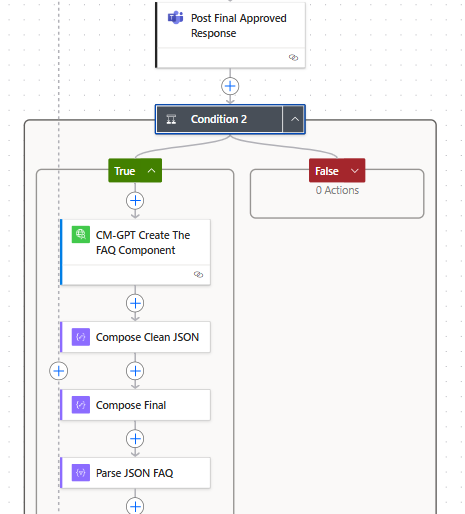

# Main logic

1. Trigger: The flow starts when an email is flagged in a specific folder.

2. Initialize Variables: Sets up variables for authorization, model, user email, and placeholders for input, comments, and cleaned email content.

3. Extract Email Content: Uses OpenAI to clean and extract the main message from the email, removing signatures and disclaimers.

4. Draft Response: Composes a draft reply using OpenAI, referencing relevant documents and formatting as required.
   

6. Approval Loop:
    Sends the draft for user approval.
    If not approved, allows for comments and re-drafting, repeating until approved or a limit is reached.
   

If the responses is Reject the verify if you want to redo with the comments or cancel the progress.

8. Post-Approval:
    If the responses is approved, create a new FAQ entries in SharePoint and notify the user. Including the Score of the Answer.
    

9. Error Handling: Sends notifications if any step fails.

    
