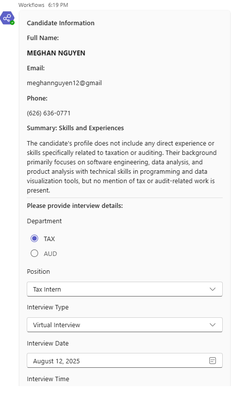
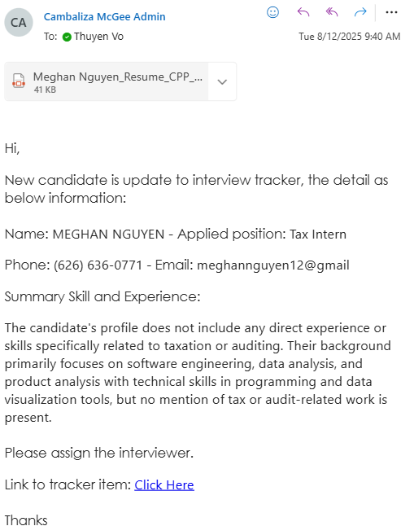
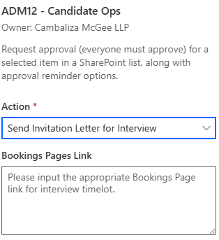

# AI-019- Monitor Talents Mail - Extract data CV with Skill and Experience - Update Interview Tracker

## Trigger: 
The flow starts when a new email **with attachments** arrives in the shared mailbox "**talents@cpa-cm.com**".

### Sender Check: 
It checks if the sender is an internal team member. If not, it sets the sender email to a default address.

### Attachment Loop (can send multiple files at same time): 
For each attachment, it checks if the file is a PDF, JPG, PNG and size > 31KB (it will exclude those images such as logo...)
### AI Processing: 
    If it’s a PDF, JPG, PNG file, the flow uses AI Builder to extract candidate information and summarize skills/experience.
### Interview Card: 
The flow posts an adaptive card to Microsoft Teams, displaying the candidate’s full name, email, phone, and a summary of skills/experiences. 
It then collects interview details, including:
* Department (TAX or AUD)
* Position (e.g., Tax Intern, Audit Manager, etc.)
* Interview Type (Virtual, In-person, etc.)
* Interview Date and Time

If you click Cancel, the flow will stop. If you click Submit it will continue to create the interview tracker.

### SharePoint Interview Tracker Update: 
The flow creates an item in the Interview Tracker SharePoint list with all collected information and attaches the PDF.

### Notification: 
It sends a confirmation email to the sender with candidate details and a link to the SharePoint item. 

If any step fails, it sends an error notification email to IT.

### Next improvement
If you want to link with the bookking page, you can input the bookking page link and send to the candidate via this flow also. You don't need to run the flow ADM12 separately

