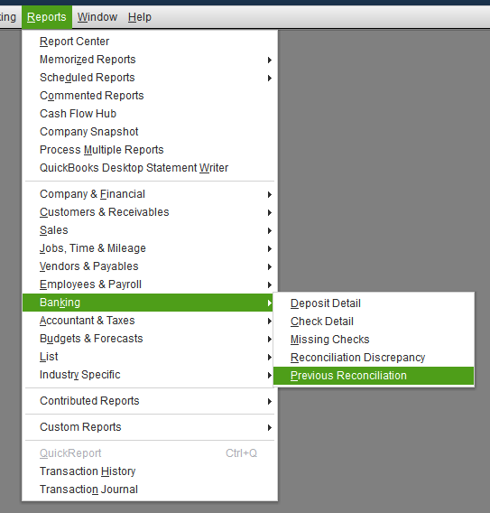
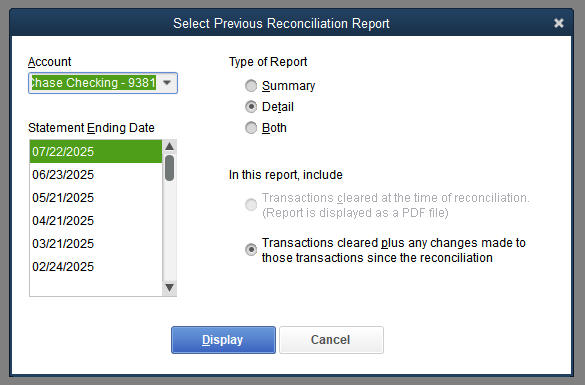
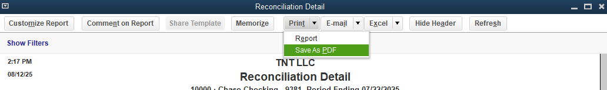
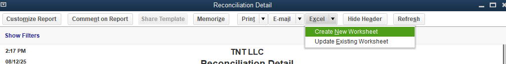

# Steps to Access and Download Reconciliation Report in QB Desktop Complete the Reconciliation

Finish reconciling your account. During the process, QuickBooks prompts you to display or print the reconciliation report once you reach a difference of zero and click “Reconcile”. If you skip this, you can access the report later.

**Access Previous Reconciliation Reports**

Go to the top menu and select Reports.
Hover over or click on Banking. Select Previous Reconciliation from the dropdown.

Choose the relevant account from the dropdown list. Select the Statement Ending Date for the period you want.

Click Display (sometimes labeled as “Run Report” or “View Report”).
Export or Save the Report

In the report window, typically, you will have a printer icon or an option to “Export” near the top right.
Click this to print the report or save it as a PDF.

For an Excel export, look for an “Export” option and select “Export to Excel” if you need the spreadsheet format.

